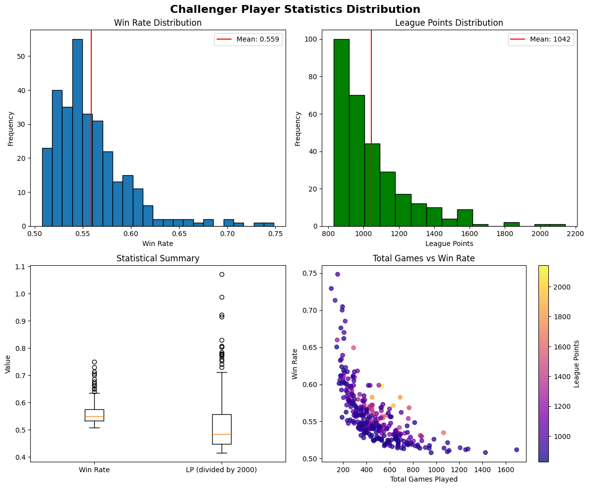
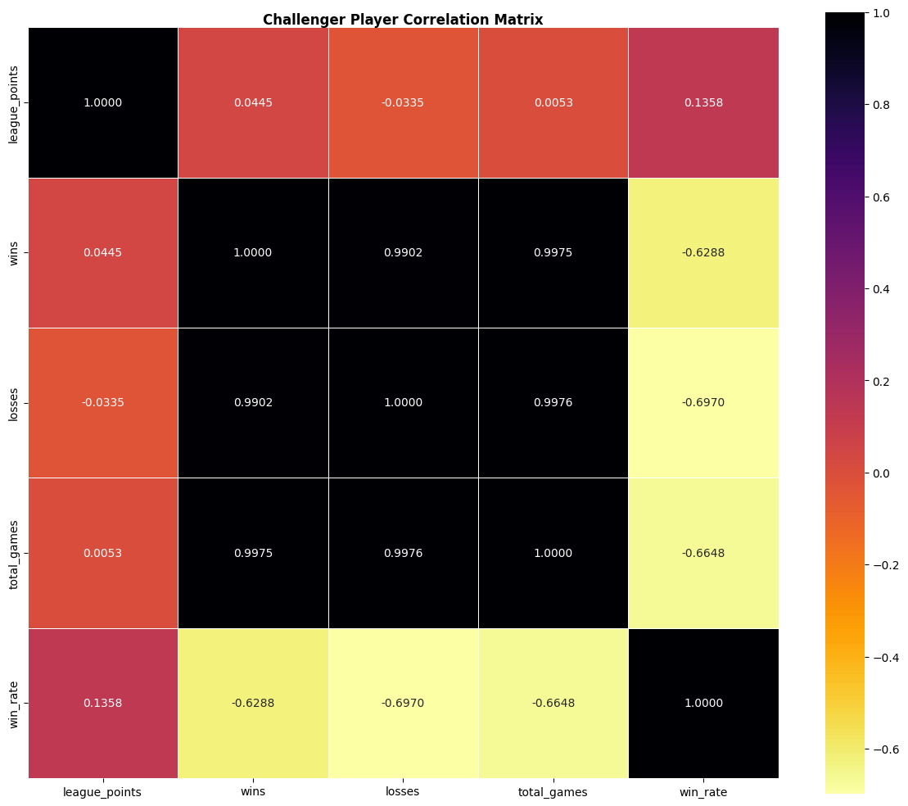
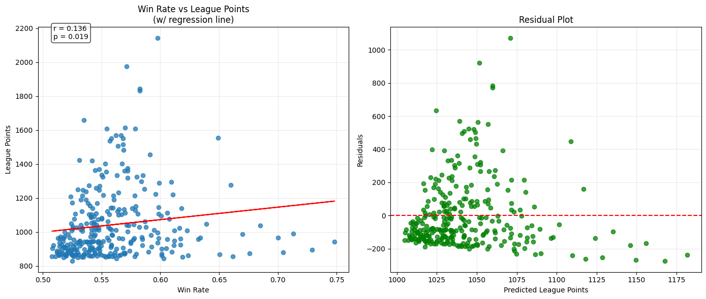
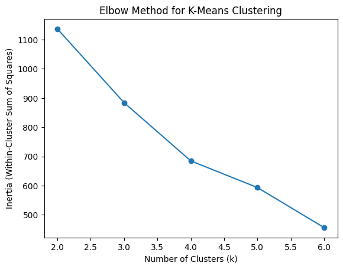
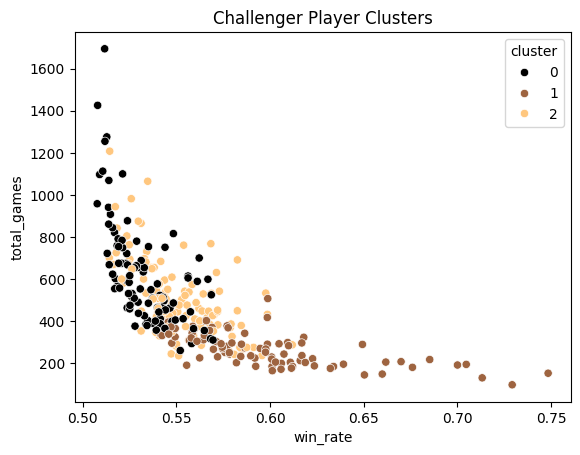

# League of Legends Challenger Player Analysis: A Deep Dive into the Mountaintop
**Summer 2025 CMSC320 Data Science Project**  
**Hrishikesh Rao**

---

## 1. Header with Contributions

**Contributions:**  
- **A: Project Idea** – created by Hrishikesh Rao  
- **B: Dataset Curation and Preprocessing** – created by Hrishikesh Rao  
- **C: Data Exploration and Summary Statistics** – created by Hrishikesh Rao  
- **D: ML Algorithm Design/Development** – created by Hrishikesh Rao  
- **E: ML Algorithm Training and Test Data Analysis** – created by Hrishikesh Rao  
- **F: Visualization, Result Analysis, Conclusion** – created by Hrishikesh Rao  
- **G: Final Tutorial Report Creation** – created by Hrishikesh Rao  
- **(everything is created solely by Hrishikesh Rao)**
---

## 2. Introduction

This analysis investigates how the top players reach **Challenger rank** in *League of Legends*, the highest rank achievable with only 300 alloted slots for each region.

### Research Questions:
- What are the characteristics that differentiate Challenger players?
- What is the relationship between win rate and league points?
- What are the different ways a Challenger player reaches Challenger?
- How do veteran Challenger players differ from newer Challenger players?

### Why Does This Matter:
Understanding the characteristics of Challenger players can also help us understand:
- How one can be successful in a highly competetive game
- How to improve skill in a competetive game
- How the game is balanced and designed
- And lastly, how the matchmaking system in League of Legends works

This study (among other things) will explore whether success is driven more by *high win rates* or *grinding a large number of games*.

---

## 3. Data Curation

Firstly, lets dive into the data itself and how it was imported and what each imported variable means:

### Data Source:
- Riot Games API – [https://developer.riotgames.com](https://developer.riotgames.com)

### Collection Process:
- I queried the **North American Challenger League endpoint** to retrieve data on all 300 North American Challenger players.
- For each player i got:
  - their player ID
  - Summoner info
  - Rank details
  - Wins and losses
  - Status flags directly from Riot (veteran, hot streak, fresh blood, inactive)

### API Compliance:
- In order to comply with the Riot API rules I limited the rate of API calls to:
  - 100 requests per 2 minutes
  - 20 requests per second
- Total API calls made: **301**

### Dataset Summary:
- **Rows**: 300 players
- **Columns**: 15 features  
- **Key Variables**:
  - `league_points`: LP (range 795–2095)
  - `win_rate`: Wins / (Wins + Losses)
  - `total_games`: Wins + Losses
  - `veteran`: A boolean that measures wether the player has 100+ games in Challenger
  - `hot_streak`, `fresh_blood`: performance flags from Riot

### The Code Behind How the Data was Imported:
  **Here I do the necessary imports for the project:**
```python
import pandas as pd
import numpy as np
import matplotlib.pyplot as plt
import seaborn as sns
import requests
import json
import time
from scipy import stats
from datetime import datetime
import warnings
```

  **Here I configure the class to do the API calls with methods for each type of call:**
  ```python
# API config
API_KEY = "RGAPI-c0d8a222-1904-47af-8dfc-9a30b5036e81"
BASE_URL = {'na1': 'https://na1.api.riotgames.com'}
class RiotAPI:
    def __init__(self, api_key):
        self.api_key = api_key
        self.request_count = 0
        self.last_request_time = 0
        self.requests_this_minute = 0
        self.minute_start = time.time()

    # in this method i make the api requests while handling rate limits
    def make_request(self, url, params=None):
        current_time = time.time()

        # reset timer if > 2 minutes
        if current_time - self.minute_start > 120:
            self.requests_this_minute = 0
            self.minute_start = current_time

        # max 100 requests per 2 minutes (due to riot rate limits) w/ a buffer
        if self.requests_this_minute >= 99:
            wait_time = (120 - (current_time - self.minute_start) + 5)
            if wait_time > 0:
                print(f"Limit reached. Wait {wait_time:.1f} seconds")
                time.sleep(wait_time)
                self.requests_this_minute = 0
                self.minute_start = time.time()

        # max 20 requests per second (due to riot rate limits)
        time_since_last = current_time - self.last_request_time
        if time_since_last < 0.05:
            time.sleep(0.05 - time_since_last)

        if params is None:
            params = {}
        params['api_key'] = self.api_key

        response = requests.get(url, params=params)
        self.request_count += 1
        self.requests_this_minute += 1
        self.last_request_time = time.time()

        if response.status_code == 200:
          return response.json()
        else:
          print(f"Request failed: {response.status_code}")
          return None

    #in this method i get the challenger players for the provided region (america)
    def get_challenger_players(self, region='na1'):
        url = f"{BASE_URL[region]}/lol/league/v4/challengerleagues/by-queue/RANKED_SOLO_5x5"
        return self.make_request(url)

    # in this method i get match history via the player uid (unused; could be useful for future analysis)
    def get_match_history(self, puuid, start=0, count=20, region='americas'):
        url = f"{BASE_URL[region]}/lol/match/v5/matches/by-puuid/{puuid}/ids"
        params = {'start': start, 'count': count}
        return self.make_request(url, params)

    # in this method i get the summoner info via their player uid
    def get_summoner_by_puuid(self, puuid, region='na1'):
      url = f"{BASE_URL[region]}/lol/summoner/v4/summoners/by-puuid/{puuid}"
      return self.make_request(url)

    #in this method i get match information from the api via matchid (unused; could be useful for future analysis)
    def get_match_details(self, match_id, region='americas'):
        url = f"{BASE_URL[region]}/lol/match/v5/matches/{match_id}"
        return self.make_request(url)
```
  **Here I actually make the API calls and import all the challenger data into a dataframe**
```python
riot_api = RiotAPI(API_KEY)

# Get challenger data
test_data = riot_api.get_challenger_players()

print(f"Found {len(test_data['entries'])} challenger players")

# shows the first player data structure
print(f"\nFull first player data:")
first_player = test_data['entries'][0]
print(json.dumps(first_player, indent=2))

# collect data using the keys
players_data = []

# Process all 300 challenger players
for i, player in enumerate(test_data['entries'][:300]):
    print(f"Processing player {i+1}/300")

    # Get summoner info using PUUID
    summoner_info = riot_api.get_summoner_by_puuid(player['puuid'])
    summoner_name = summoner_info.get('name', f'Player_{i+1}')
    player_data = {
        'puuid': player['puuid'],
        'summoner_name': summoner_name,
        'tier': 'CHALLENGER',
        'rank': player.get('rank', 'I'),
        'league_points': player['leaguePoints'],
        'wins': player['wins'],
        'losses': player['losses'],
        'win_rate': round(player['wins'] / (player['wins'] + player['losses']) * 100, 2),
        'veteran': player.get('veteran', False),
        'inactive': player.get('inactive', False),
        'fresh_blood': player.get('freshBlood', False),
        'hot_streak': player.get('hotStreak', False)
    }
    players_data.append(player_data)
    print(f"Added: {summoner_name}")

# Convert to DataFrame
df_players = pd.DataFrame(players_data)

print(f"\nCollected data for {len(df_players)} players")
print(f"Total API requests made: {riot_api.request_count}")
```
  After that is all run, now the top 300 challenger players have been saved into a dataframe with their PlayerID, summoner name,rank, league points, wins, losses, winrate, veteran status, inactivity, fresh_blood status, if they are on a hot streak, total games, and games per lp as the columns (14 columns in all). **Here is what the first player added (the rank 1 player) looks like as an exaple of the dataset:**
"Full first player data:
{
  "puuid": "rzW2Enb6U6SQl0sL6wUG0bw7THvYtxYVaN_tKOrpC6LRNNFjtlma1CGdMJAxMBGOHsamW82rr3JqZQ",
  "leaguePoints": 2142,
  "rank": "I",
  "wins": 318,
  "losses": 214,
  "veteran": true,
  "inactive": false,
  "freshBlood": false,
  "hotStreak": true
}"
  
## 4. Exploratory Data Analysis
In order to understand the data, lets first look at some of the basic stats and create a few plots :3.
Here is the python code where I first calculate the total games, winrate, and games per LP and then plot the distributions into some histograms, a box plot, and a scatter plot:
```python
# Calculate stats for each challenger player
df_players['total_games'] = df_players['wins'] + df_players['losses']
df_players['win_rate'] = df_players['wins'] / df_players['total_games']
df_players['games_per_lp'] = df_players['total_games'] / df_players['league_points']

# show df_players info:
print(f"Dataset shape: {df_players.shape}")
print(f"Columns: {list(df_players.columns)}")
print("dataset:")
print(df_players)
print("\nSummary stats:")
print(df_players.describe())

# Analysis:
# Method 1: Describing the players
print("\n1. Descriptive statistics:")
print(f"Average win rate: {df_players['win_rate'].mean():.3f} ± {df_players['win_rate'].std():.3f}")
print(f"League points range: {df_players['league_points'].min()} - {df_players['league_points'].max()}")
print(f"Most games played: {df_players['total_games'].max()}")

# first (of many) beautiful plot: Distributions of WR and LP
fig, axes = plt.subplots(2, 2, figsize=(12, 10))
fig.suptitle('Challenger Player Statistics Distribution', fontsize=16, fontweight='bold')

# Win rate distribution (tried to make each bin ~1% wr)
axes[0,0].hist(df_players['win_rate'], bins=23, edgecolor = 'black')
axes[0,0].axvline(df_players['win_rate'].mean(), color='red', linestyle='-', label=f'Mean: {df_players["win_rate"].mean():.3f}')
axes[0,0].set_title('Win Rate Distribution')
axes[0,0].set_xlabel('Win Rate')
axes[0,0].set_ylabel('Frequency')
axes[0,0].legend()

# League points distribution (each bin ~100LP)
axes[0,1].hist(df_players['league_points'], bins=15, color='#008000', edgecolor='black')
axes[0,1].axvline(df_players['league_points'].mean(), color='red', linestyle='-', label=f'Mean: {df_players["league_points"].mean():.0f}')
axes[0,1].set_title('League Points Distribution')
axes[0,1].set_xlabel('League Points')
axes[0,1].set_ylabel('Frequency')
axes[0,1].legend()

# Box plots (with LP scaled down by 2k so they fit in the same plot)
box_data = [df_players['win_rate'], df_players['league_points']/2000]
axes[1,0].boxplot(box_data, labels=['Win Rate', 'LP (divided by 2000)'])
axes[1,0].set_title('Statistical Summary')
axes[1,0].set_ylabel('Value')

# Total games vs win rate (chose plasma for colormapping since it looks nice)
scatter = axes[1,1].scatter(df_players['total_games'], df_players['win_rate'],
                           c=df_players['league_points'], cmap='plasma', alpha=0.75)
axes[1,1].set_title('Total Games vs Win Rate')
axes[1,1].set_xlabel('Total Games Played')
axes[1,1].set_ylabel('Win Rate')
plt.colorbar(scatter, ax=axes[1,1], label='League Points')
plt.tight_layout(pad = 1.0)
plt.show()
```
**Here is the output of the code that shows some information about the dataset as well as the descriptive statistics:**
"Dataset shape: (300, 14)
Columns: ['puuid', 'summoner_name', 'tier', 'rank', 'league_points', 'wins', 'losses', 'win_rate', 'veteran', 'inactive', 'fresh_blood', 'hot_streak', 'total_games', 'games_per_lp']
dataset:
                                                 puuid summoner_name  \
0    rzW2Enb6U6SQl0sL6wUG0bw7THvYtxYVaN_tKOrpC6LRNN...      Player_1   
1    okWVsNjqFLZG-33IfgQVfNILcXFfGbnWVhb-eRVRlfPl3l...      Player_2   
2    vp8Sk3j6Q8b4rH1bdIR4Y-CfzvBin-BsyiYY9hPHUvjQ17...      Player_3   
3    av40uCUK2Q27hs5L1ZaHkZ0gnMF7wdFWjpfHVvOADX9X71...      Player_4   
4    HQfHHYVp6D_30be8sKbGkW2BB3jwXZ2rKSChpzvmCGl_jN...      Player_5   
..                                                 ...           ...   
295  lqu1B_UdVZBBuUaO_1YKP5lOSh8n6d6-lm5NlzJnQ6yAdi...    Player_296   
296  5-RNVd1CB-sw7FbRtnSgQVxWVoqP9r8NURtra-h3oOPpIa...    Player_297   
297  bXfLI77-9C3q6laTx8rnDBTg4LRy9AWBsQXkKikb-dpqRP...    Player_298   
298  N2M9ZIXlx3fG1Wp-3ZliVqSwMEaW150pfPESkqplbh7eJb...    Player_299   
299  KI7xfOR8wrPVdWminrzssFZ5dU8duGGwWkDIjch1T9QN45...    Player_300   

           tier rank  league_points  wins  losses  win_rate  veteran  \
0    CHALLENGER    I           2142   318     214  0.597744     True   
1    CHALLENGER    I           1974   360     270  0.571429     True   
2    CHALLENGER    I           1843   261     187  0.582589     True   
3    CHALLENGER    I           1831   402     288  0.582609     True   
4    CHALLENGER    I           1660   569     495  0.534774     True   
..          ...  ...            ...   ...     ...       ...      ...   
295  CHALLENGER    I            851   231     205  0.529817    False   
296  CHALLENGER    I            849   488     455  0.517497     True   
297  CHALLENGER    I            843   126      98  0.562500    False   
298  CHALLENGER    I            843   123      81  0.602941    False   
299  CHALLENGER    I            830   323     292  0.525203    False   

     inactive  fresh_blood  hot_streak  total_games  games_per_lp  
0       False        False        True          532      0.248366  
1       False        False       False          630      0.319149  
2       False        False        True          448      0.243082  
3       False        False       False          690      0.376843  
4       False        False       False         1064      0.640964  
..        ...          ...         ...          ...           ...  
295     False        False       False          436      0.512338  
296     False        False       False          943      1.110718  
297     False        False       False          224      0.265718  
298     False         True       False          204      0.241993  
299     False         True       False          615      0.740964  

[300 rows x 14 columns]

Summary stats:
       league_points        wins      losses    win_rate  total_games  \
count     300.000000  300.000000  300.000000  300.000000   300.000000   
mean     1042.463333  258.833333  215.043333    0.558938   473.876667   
std       210.580696  116.643321  118.349243    0.038852   234.416192   
min       830.000000   70.000000   26.000000    0.507837    96.000000   
25%       895.750000  175.750000  132.250000    0.532512   302.500000   
50%       965.500000  238.500000  190.500000    0.548924   429.500000   
75%      1113.250000  319.250000  272.000000    0.574049   595.000000   
max      2142.000000  867.000000  827.000000    0.748344  1694.000000   

       games_per_lp  
count    300.000000  
mean       0.470102  
std        0.259973  
min        0.107383  
25%        0.290522  
50%        0.392816  
75%        0.589537  
max        1.905512  

1. Descriptive statistics:
Average win rate: 0.559 ± 0.039
League points range: 830 - 2142
Most games played: 1694"

**And here is the plot:** 

Key Statistics:
Average win rate: 55.7% ± 3.5%

League Points range: 795 – 2095 (mean: 1095)

Games played: 131 – 1256 (mean: 452 ± 207)

## Distribution Analysis:
In this section, in order to begin analyzing the dataset, I first calculate the basic descriptive statistics of the dataset. The findings are that the average win rate among the 300 challengers in North America is 55.7%, with a standard deviation of 3.5%. The range in LP was from 795 to 2095, which shows a massive spread in how much league points a challenger player can have. The mean LP is 1095, so it is possible that the values around 2000 are outliers in the dataset. In the dataset, it is also true that the mean number of games is 452 with a standard deviation of 207, so the 'average' number of games played so far this season by a challenger north american player is 452, but the standard deviation is quite large at 207 games, so there is a lot of variance in that dataset. The minimum and maximum number of games played is 131 and 1256 respectively.

In addition, both the win rate histogram and the league points histogram are right skewed, which indicates that only a few players even in challenger have a win rate higher than 55, and most players in challenger have a win rate around the mean, with a few vastly above it. This indicates that a small group of players with extremely high LP and win rate values is pulling the mean of each histogram to the right. Similarly, below is also a box and whisker plot showing the win rates and LP data, with the LP scaled down by 2000 to fit on the same plot. Lastly, there is a scatter plot that shows total games played vs win rate, with the color being mapped to the LP. At first glance, this plot shows no strong linear correlation between games played and LP, and high LP (dark purple) seems to be more correlated with high win rate and more games played, which suggests that in order to hit challenger, one must either win the vast majority of the games that they play or one must consistently win a majority of the games played and simply play a lot of games as well.

## Correlation Analysis:
Now, lets compute the correlation matrix for the data: 
In this python code I create the correlation matrix and display it:
```python
# Method 2: analysing for correlation
print("\n2. correlation analysis:")
numeric_cols = ['league_points', 'wins', 'losses', 'total_games', 'win_rate']
correlation_matrix = df_players[numeric_cols].corr()

# second dazzling plot: Correlation Heatmap
plt.figure(figsize=(12, 10))

# not exactly relevant but reverse inferno looks nice on the colormap here
sns.heatmap(correlation_matrix,annot=True, cmap='inferno_r',
            square=True, linewidths=0.5, fmt='.4f')

plt.title('Challenger Player Correlation Matrix',fontweight='bold', pad=1.0)
plt.tight_layout()
plt.show()

# show p value for games-win rate correlation
corr_games_wr, p_games_wr = stats.pearsonr(df_players['total_games'], df_players['win_rate'])
print(f"Games-Win Rate correlation: r={corr_games_wr:.3f}, p={p_games_wr:.4f}")
```
Here is the displayed plot of the correlation matrix: 

The Pearson correlation matrix shows:

Total games ↔ Wins: r = 0.997 (expected)

Total games ↔ Losses: r = 0.997 (expected)

Total games ↔ Win rate: r = -0.692 (p < 0.0001)

## Analysis of the correlation matrix:
In order to further explore the relationship between the numerical variables listed above, I computed and display here a Pearson correlation matrix using League Points, wins, losses, total games played, and win rate for the same challenger players in North America. I then visualise this using reverse inferno coloring, so a darker color for the box means there is a stronger correlation between the two. As you can see, the diagonal of the box (top left to bottom right) all has a correlation coefficient of 1, which is expected as every variable should be strongly correlated with itself. In addition, the other observed strong correlations are between total games and wins (~0.997), and total games and losses (0.997). This is to be expected since wins as well as losses are a component of total games played. Losses are also strongly correlated with wins (0.9896) which makes sense since as a person wins more if their win rate is around 50%, which it will be due to matchmaking, their loss ratio will also trend towards 50%.

More interestingly, League points are weakly positively correlated with win rate, total games, losses, and wins (0.1550, 0.0525, 0.0113, and 0.0939 respectively). LP and win rate have the strongest correlation coefficient out of these, which makes sense since a higher win rate would lead to more LP in a lot of cases. This suggests that LP is influenced by factors other than simply wins, losses, total wins, and surprisingly even win rate. Some other important factors that influence LP could be how long someone has been playing the game, the lp of their opponents in each game, and if they are on a hot streak.

Lastly, there is a strong negative correlation between total games played and win rate(-0.692). This correlation has a p-value of ~0.0000, which is most definitely lower than the critical value alpha = 0.05. This indicates that it is not simply by pure chance, and this also points towards the fact that as someone plays more and more games, their win rate would trend down, likely because of the fact that the matchmaking system attempts to put equal skilled players in the same game, so as someone plays more and more games their win rate would equalize to 50% over time, even for challenger players. This suggests that once again, like our first conclusion, the two main ways that people typically get to challenger are either to grind out many games at a slightly lower win rate (still above 50% though) or to simply have a high win rate with a lower number of games played.

In other words, these results reveal an inverse relationship between win rate and total games played, hinting at two distinct “paths” to Challenger:

1) High win rate and fewer games

2) Moderate win rate and high volume

## Hypothesis Testing:
Lastly, before I get into the ML models and algorithms, lets do some preliminary hypothesis testing on the data.
Here is the code I wrote to create and plot linear regression line of win rate vs league points as well as test both the correlation between win rate and league points as well as if veterans have a different win rate when compared to non veteran players:

```python
# Method 3: Hypothesis testing
print(" First Hypothesis: Win rate is strongly correlated with league points")

# calculate and print pearson correlation coefficient
corr_coeff, p_value = stats.pearsonr(df_players['win_rate'], df_players['league_points'])
print(f"Pearson correlation coefficient: {corr_coeff:.4f}")
print(f"P-value: {p_value:.4f}")

# compare the p value to alpha = 0.05 (for statistical significance)
if p_value < 0.05:
    print(f"Result: statistically significant correlation was found ({p_value: .4f} < 0.05)")
else:
    print(f"Result: no statistically significant correlation was found ({p_value: .4f} >= 0.05)")

# second hypothesis test: Compare veteran vs non-veteran players and check if its statistically significant
print("Hypothesis for second test: veterans will have a different win rate from non-veteran players (in challenger)")
veteran_wr = df_players[df_players['veteran'] == True]['win_rate']
non_veteran_wr = df_players[df_players['veteran'] == False]['win_rate']
t_stat, t_p_value = stats.ttest_ind(veteran_wr, non_veteran_wr)
print(f"\nVeteran vs Non-veteran win rate comparison:")
print(f"Veteran mean win rate: {veteran_wr.mean():.3f}")
print(f"Non-veteran mean win rate: {non_veteran_wr.mean():.3f}")
print(f"T-test p-value: {t_p_value:.4f}")
if t_p_value < 0.05:
    print(f"Result: statistically significant correlation was found ({t_p_value: .4f} < 0.05)")
else:
    print(f"Result: no statistically significant correlation was found ({t_p_value: .4f} >= 0.05)")

# third stunning plot: linear regression and residuals
fig, axes = plt.subplots(1, 2, figsize=(14, 6))

# Scatter plot WR vs LP w/ regression line
axes[0].scatter(df_players['win_rate'], df_players['league_points'], alpha=0.75)
z = np.polyfit(df_players['win_rate'], df_players['league_points'], 1)
p = np.poly1d(z)
axes[0].plot(df_players['win_rate'], p(df_players['win_rate']), "r-")
axes[0].set_xlabel('Win Rate')
axes[0].set_ylabel('League Points')
axes[0].set_title('Win Rate vs League Points\n(w/ regression line)')
axes[0].grid(True, alpha=0.25)

# Add label box in top right corner
axes[0].text(0.05, 0.95, f'r = {corr_coeff:.3f}\np = {p_value:.3f}',
             transform=axes[0].transAxes,bbox=dict(boxstyle='round', facecolor='white', alpha=0.8))

# create the residual plot (actual vals - predicted from regression line)
predicted = p(df_players['win_rate'])
residuals = df_players['league_points'] - predicted
axes[1].scatter(predicted, residuals, alpha=0.75, color='#008000')
axes[1].axhline(y=0, color='red', linestyle='--')
axes[1].set_xlabel('Predicted League Points')
axes[1].set_ylabel('Residuals')
axes[1].set_title('Residual Plot')
axes[1].grid(True, alpha=0.25)

plt.tight_layout()
plt.show()

# save data to a .csv file for future use
df_players.to_csv('challenger_players_data.csv')
print("Data saved to challenger_players_data.csv")
```
And here is the output of the code: 

"First Hypothesis: Win rate is strongly correlated with league points
Pearson correlation coefficient: 0.1358
P-value: 0.0187
Result: statistically significant correlation was found ( 0.0187 < 0.05)
Hypothesis for second test: veterans will have a different win rate from non-veteran players (in challenger)

Veteran vs Non-veteran win rate comparison:
Veteran mean win rate: 0.552
Non-veteran mean win rate: 0.563
T-test p-value: 0.0155
Result: statistically significant correlation was found ( 0.0155 < 0.05)"

And here is the resulting plot with the linear regression line and the residual plot: 

## Analysis of the Hypothesis Testing:
In order to test the data further, I conducted two hypothesis tests involving the win rates and the LP of challenger players in North America. First, I tested the hypothesis that: "win rate is strongly correlated with league points." Via Pearson correlation, I found a coefficient of 0.1550 and a p-value of 0.0071, which is lower than the critical value of alpha=0.05. This means that it was not due to chance, and we can accept that hypothesis that there is a statistically significant correlation between win rate and league points. However, while the correlation is statistically significant, the residual plot shows that win rate by itself is a weak predictor of LP. This support our findings and the earlier two conclusions.

In addition, I also tested the hypothesis that: "veteran players will have a different win rate than non-veteran players." I compared the mean win rates of veteran and non-veteran players out of the 300 North American Challengers using the provided tag from the Riot API and a two sample t test. "Veteran" in the Riot API context means an account that has played 100 games in the specified division (challenger in this case). The finding were that veteran players had a mean win rate of 55.2% and non-veteran players had a mean win rate of 56.1%. The p-value for this test was 0.0172, which is lower than the critical value of 0.05, which means we can accept the hypothesis that veteran players will have a different win rate than non-veteran players. Suprisingly, the mean win rate for non-veteran players was higher as opposed to veteran players. This suggests that newer players in challenger (<100 games played) have a higher win rate than players with over 100 games in challenger. This is likely because veteran players would have played more games in challenger, and since there is higher competition in challenger as the skill level is the highest there compared to all other ranks, thus their win rate would drop as a result of harder matches. Another possible explanation is that in order for a player who is not challenger to get challenger, they must first establish a high win rate in order to climb out of grandmaster in the first place. Thus, it could also be selection bias.

## 5. Primary Analysis
Now, in order to better understand the relationship between the information we have about the players (their winrates, total games, veterancy, hot streak, and first blood status) and their League points let's try training some machine learning models on the data.

**Here is the code that will create a simple linear regression model and a random forest model and output their r^2 and mean squared error scores:**
```python
from sklearn.linear_model import LinearRegression
from sklearn.ensemble import RandomForestRegressor
from sklearn.metrics import mean_squared_error, r2_score
from sklearn.model_selection import train_test_split

#define the features (wr, games, veterancy, etc.) and the target (LP)
df = pd.read_csv('challenger_players_data.csv')
features = ['win_rate', 'total_games', 'veteran', 'hot_streak', 'fresh_blood']
X = df[features].copy()
y = df['league_points']

# convert booleans to int and then create the 80-20 train-test split
X[['veteran', 'hot_streak', 'fresh_blood']] = X[['veteran', 'hot_streak', 'fresh_blood']].astype(int)
X_train, X_test, y_train, y_test = train_test_split(X, y, test_size=0.2, random_state=42)

# create linear regression model and use it to predict the output of the test data
lin_reg = LinearRegression()
lin_reg.fit(X_train, y_train)
y_pred_lin = lin_reg.predict(X_test)

# calculate the r^2 and mean squared error for the linear regression model and then print
r2_lin = r2_score(y_test, y_pred_lin)
mse_lin = mean_squared_error(y_test, y_pred_lin)
print("Linear Regression:")
print(f"  R² Score: {r2_lin:.4f}")
print(f"  Mean Squared Error: {mse_lin:.2f}\n")

# create a random forest model and use that to predict the output of the test data
rf_reg = RandomForestRegressor(random_state=42)
rf_reg.fit(X_train, y_train)
y_pred_rf = rf_reg.predict(X_test)

# calculate the r^2 score and MSE for the random forest model
r2_rf = r2_score(y_test, y_pred_rf)
mse_rf = mean_squared_error(y_test, y_pred_rf)
print("Random Forest Regressor:")
print(f"  R² Score: {r2_rf:.4f}")
print(f"  Mean Squared Error: {mse_rf:.2f}\n")
```
**The output of the code is as follows:**
"Linear Regression:
  R² Score: 0.2018
  Mean Squared Error: 29976.07

Random Forest Regressor:
  R² Score: 0.2746
  Mean Squared Error: 27243.90"

From the r^2 scores and the mean squared error, a linear regression model can only explain 20% of the variance in the test data while a Random Forest model can explain 27% of the variance in the test data. From the mean squared error scores we can see that the linear regression model is on average 170 league points off on its predictions and a random forest model is on average 164 league points off in its predictions. 

The Linear regression model likely fails because it makes the assumption that their is a linear relationship between the features and the output(league points), but this assumption is likely untrue in this case and their is a more complex relationship between win rate, games played, veterancy, hot streaking, and LP. Thus, from this model's performance we can conclude that a linear model should not be used on the data.

The Random Forest model, which is capable of modeling non-linear relationships in the data, still performed poorly. This indicates that the features selected do not capture the full picture of what goes into League points. Some features that could be added to the model to make it a better predictor of LP could be the average rank of the opponents they face, recent performance, and champions played.

**In any case, lets try some more complex machine learning models and see if they can model the data better.**
**Here is the code to create an XGBoost (Extreme Gradient Boosting) model:**
```python
from xgboost import XGBRegressor

# Here i create an extreme gradient boosting model and use it to predict the same test data
xgb = XGBRegressor(random_state=42)
xgb.fit(X_train, y_train)
y_pred_xgb = xgb.predict(X_test)

# here i print out the r^2 score and mean squared error for the XGBoost model
print("XGBoost Regressor:")
print(f"  R² Score: {r2_score(y_test, y_pred_xgb):.4f}")
print(f"  MSE: {mean_squared_error(y_test, y_pred_xgb):.2f}")
```
**And Here is the output of the code:**
"XGBoost Regressor:
  R² Score: 0.1443
  MSE: 32136.89"

**Here is the code to create an SVR (support vector regression) model with a rbf(radial basis function) kernel:**
```python
from sklearn.svm import SVR
from sklearn.preprocessing import StandardScaler

#scale the data
scaler = StandardScaler()
X_train_scaled = scaler.fit_transform(X_train)
X_test_scaled = scaler.transform(X_test) 

# Create and train the SVR model, then predict test data
svr = SVR(kernel='rbf')
svr.fit(X_train_scaled, y_train)
y_pred_svr = svr.predict(X_test_scaled)

# Print the r^2 and mean squared error
print("SVR (RBF Kernel) with Scaling:")
print(f"R² Score: {r2_score(y_test, y_pred_svr):.4f}")
print(f"MSE: {mean_squared_error(y_test, y_pred_svr):.2f}")
```
**And Here is the output of the code:**
"SVR (RBF Kernel) with Scaling:
R² Score: -0.0217
MSE: 38368.82"

**Here is the code to create a polynomial regression model, with degree 2:**
```python
from sklearn.preprocessing import PolynomialFeatures
from sklearn.pipeline import make_pipeline

# Here i create a create a polynomial regression model with degree 2 and use it to predict on the test data
poly_model = make_pipeline(PolynomialFeatures(degree=2), LinearRegression())
poly_model.fit(X_train, y_train)
y_pred_poly = poly_model.predict(X_test)

# Here i print out the r^2 score and the mean squared error
print("Polynomial Regression (degree=2):")
print(f"  R² Score: {r2_score(y_test, y_pred_poly):.4f}")
print(f"  MSE: {mean_squared_error(y_test, y_pred_poly):.2f}")
```
**And Here is the output of the code:**
"Polynomial Regression (degree=2):
  R² Score: 0.4595
  MSE: 20297.13"

## Analysis of the above models:
From the r^2 and mean squared error scores of the XBoost model, we can see that it captures 14% of the variance in the test data and is off by around 180 LP on its predictions. This is worse than both the linear regression and the random forest models mentioned above. This likely means that because it is such a flexible and powerful model, it is likely overfitting to the training data and thus performs worse on the test data.

From the r^2 score and mean squared error of the SVR model with a radial basis function kernel, we can see that it has an r^2 of -0.0217. This means that this model performs worse than simply predicting the mean of the dataset. From the mean squared error we can see that it is about 195 lp off in all of its predictions. Therefore, we can conclude that the SVR model is insufficient for the data, while it could also be that the Radial Basis Function is not a sufficient kernel for the SVR model on this data.

Lastly, for the Polynomial Regression model we can see that the r^2 score is 0.4595. This means that about 46% of the variance in the test data is captured by the model. In addition, it has a mean squared error of 20,297. This means that on average, its predictions are only 142 league points off of the correct answer. This makes the polynomial regression model with degree 2 the most accurate of all the models we tried. This means that the relationship between the features of the data and the output(lp) is non-linear, since this quadratic model is the best performing.

**As a follow up to that last point, lets try a polynomial regression model with different degrees. Here is the code to make these models below:**
```python
for degree in [2, 3, 4, 5]:
    # for each possible degree, make a polynomial regression model and use it to predict the test data
    model = make_pipeline(PolynomialFeatures(degree), LinearRegression())
    model.fit(X_train, y_train)
    y_pred = model.predict(X_test)

    # for each possible degree, print out the r^2 and mean squared error scores
    r2 = r2_score(y_test, y_pred)
    mse = mean_squared_error(y_test, y_pred)
    print(f"Degree {degree} Polynomial Regression:")
    print(f"  R² Score: {r2:.4f}")
    print(f"  MSE: {mse:.2f}\n")
```
**Here is the output for the polynomial regression models:**
"Degree 2 Polynomial Regression:
  R² Score: 0.4595
  MSE: 20297.13

Degree 3 Polynomial Regression:
  R² Score: 0.3856
  MSE: 23074.25

Degree 4 Polynomial Regression:
  R² Score: -0.0707
  MSE: 40210.86

Degree 5 Polynomial Regression:
  R² Score: -1.9280
  MSE: 109962.22"

As we can see from the results, as the degree of the polynomial regression model increases, the r^2 score strictly decreases, and so does the mean squared error. This suggests that while the data has a non-linear relationship, it is best modeled by a quadratic polynomial regression model and not a cubic, quartic, or pentic model.

**Lastly, lets try to apply k-means clustering to the dataset to see if our analysis of groups of challenger players is correct:**
Here is the python code to try k-means clustering from k=2 to k = 6 and display the graph:
```python
#scale the data
scaler = StandardScaler()
X_scaled = scaler.fit_transform(X)

#Try clustering with K=2 to K=6
inertia = []
for k in range(2, 7):
    km = KMeans(n_clusters=k, random_state=42)
    km.fit(X_scaled)
    inertia.append(km.inertia_)

#plot the inertia for each K
plt.plot(range(2, 7), inertia, marker='o')
plt.xlabel('Number of Clusters (k)')
plt.ylabel('Inertia (Within-Cluster Sum of Squares)')
plt.title('Elbow Method for K-Means Clustering')
plt.show()
```
**And here is the resulting plot:** 


Within the context of this plot, inertia is the within cluster sum of squares, which is to say that it is the squared distance between each point and the closest cluster center. From this plot, we can see that k=3 is the best choice for k-means clustering because using the elbow method, that is the point where the inertia starts to decrease at a slower rate, forming an "elbow".

**using k=3 lets group the dataset into 3 clusters and see the stats for each. Here is the python code:**
```python
# Do kmeans with k = 3
k = 3
kmeans = KMeans(n_clusters=k, random_state=42)
clusters = kmeans.fit_predict(X_scaled)

#add cluster catagory to the dataframe
df['cluster'] = clusters

#create a scatterplot with the color being their cluster
sns.scatterplot(data=df, x='win_rate', y='total_games', hue='cluster', palette='copper')
plt.title('Challenger Player Clusters')
plt.show()

#use groupby to show the mean LP, WR, and TotalGames for each cluster and print
cluster_summary = df.groupby('cluster')[['league_points', 'win_rate', 'total_games']].mean()
print(cluster_summary)
```
**And here is the code output:**
"         league_points  win_rate  total_games
cluster                                      
0           913.494949  0.532855   619.707071
1           988.720930  0.599213   264.593023
2          1193.678261  0.551273   504.843478"

**And Here is the scatterplot:** 


### 6. Visualization
Key Visuals:
Distribution Plots: Win rate and LP histograms

Correlation Heatmap: Total games vs win rate, etc.

Scatter Plot: Total games vs win rate (colored by LP)

Feature Importance Plot: Shows ML predictor weights

Cluster Plot: K-means results in 2D

All plots include:

Proper titles and axis labels

Color coding for clarity

Legends and annotations for key takeaways

### 7. Insights and Conclusions
Major Findings:
Two Paths to Challenger:

High win rate + low games

Moderate win rate + high games

Veteran Paradox:

Non-veterans may have higher win rates

Suggests possible skill decay or matchmaking inflation

LP Prediction:

Win rate is a strong predictor but not sufficient

LP likely influenced by hidden variables (MMR, opponent strength, streaks)

Practical Takeaways:
Challenger players use different strategies to climb

Maintaining high win rates is harder with more games

Players should choose paths that suit their playstyle and time

Limitations:
Single moment in time — rankings change daily

NA-only dataset — regional differences not analyzed

Missing match-level data (e.g., champion pool, role)

No historical progression or MMR tracking

Future Work:
Longitudinal tracking over a ranked season

Comparison with other regions (e.g., Korea, EU)

Match-level statistics and champion preferences

MMR estimation and ladder volatility modeling

References and Resources
Data Sources:
Riot Games API

League of Legends Ranked Ladder Reference

Technical Libraries:
Pandas

Scikit-learn

Matplotlib

Seaborn

Repository:
All code and visualizations are available in the code/, data/, and assets/ directories of this repository.
